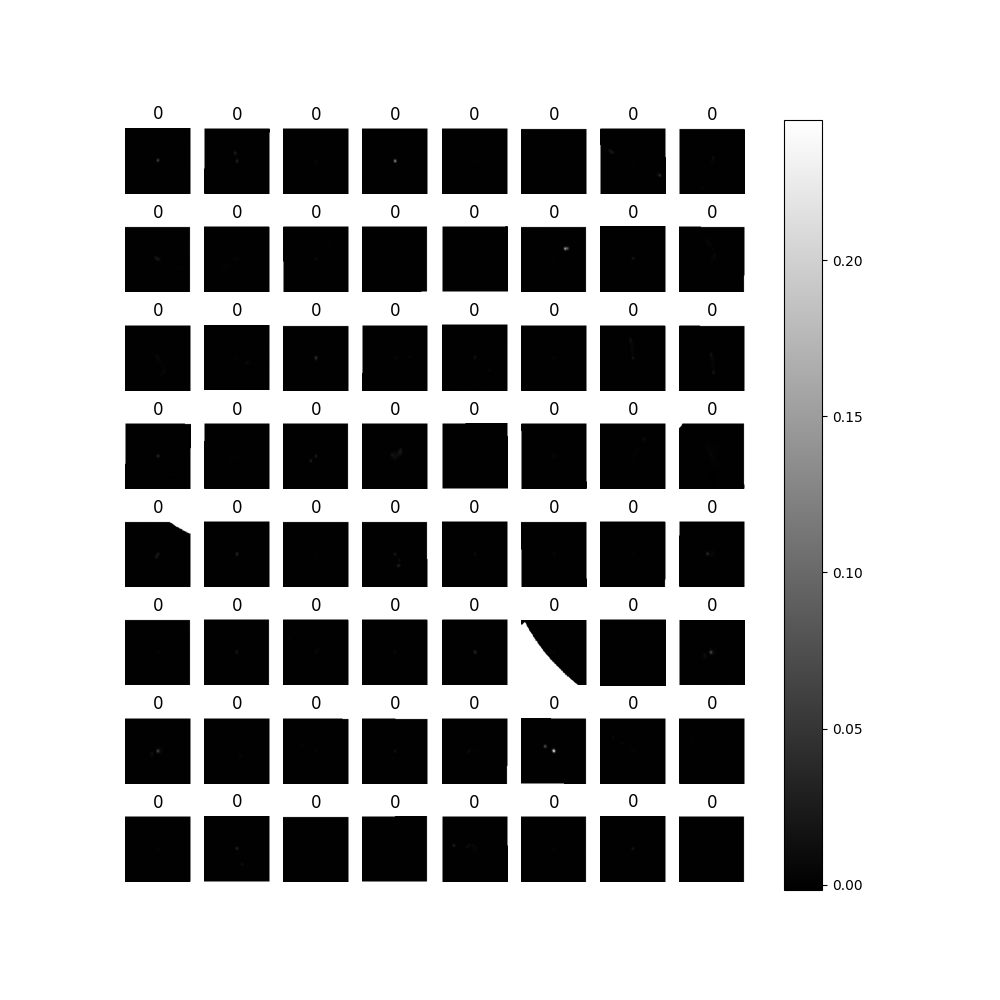
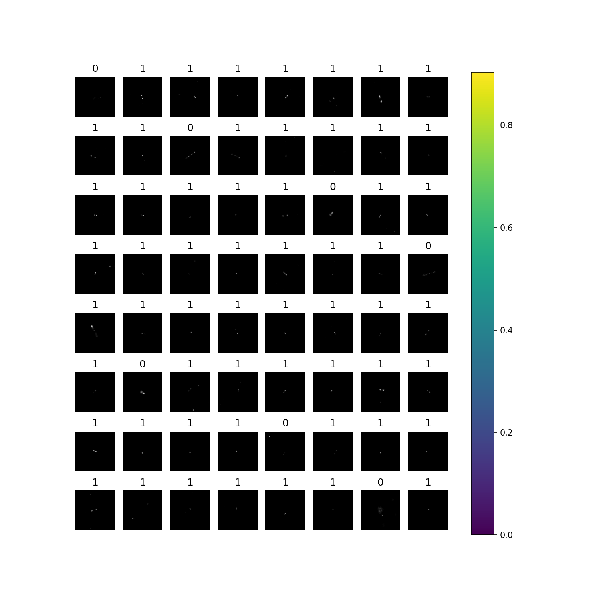
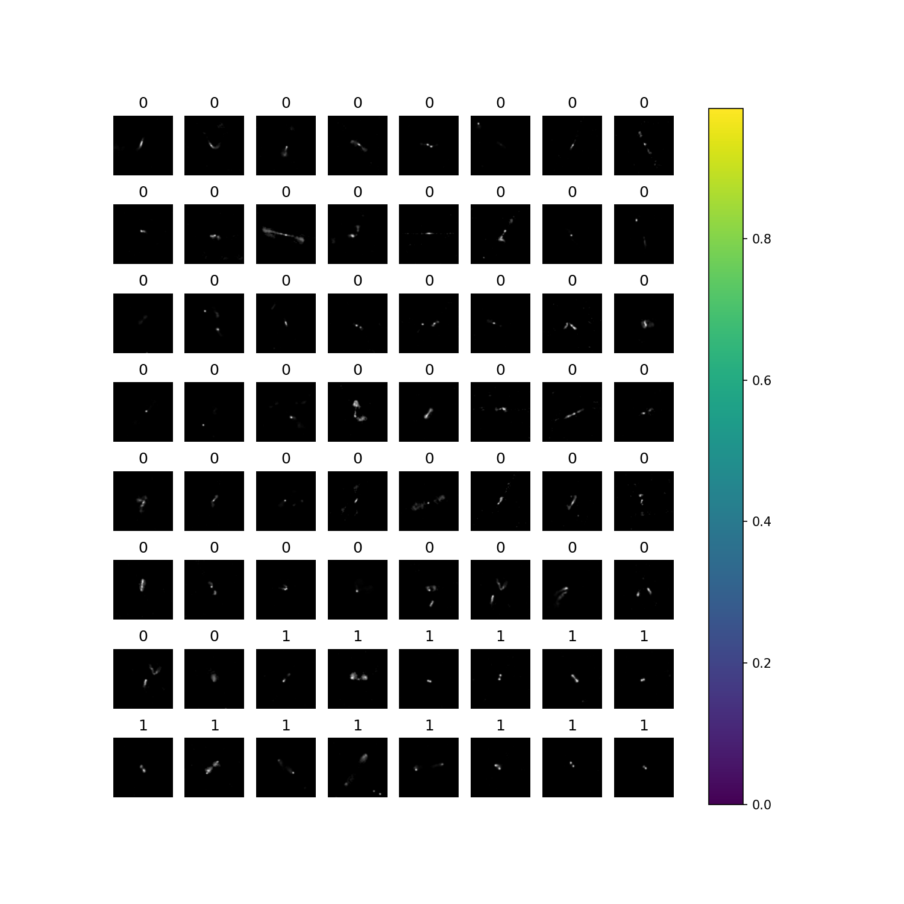

# Learning Radio Astronomical Representations with LeJEPA and Very Small Models

## Dependencies
[PyTorch Implementation for BYOL - Bootstrap Your Own Latent: A New Approach to Self-Supervised Learning](https://github.com/sthalles/PyTorch-BYOL)

[PyTorch implementation of SimCLR: A Simple Framework for Contrastive Learning of Visual Representations](https://github.com/sthalles/SimCLR)

## Datasets
RGZ20k: download via https://github.com/inigoval/fixmatch/blob/master/main/dataloading/datasets.py

RGZ: https://drive.google.com/open?id=1x8ZkmuQrDdQdG_UVZPrWr0lj2dfxil3F

FIRST: https://github.com/floriangriese/RadioGalaxyDataset

MiraBest: download via https://github.com/inigoval/fixmatch/blob/master/main/dataloading/datasets.py

## Training Code
LeJEPA: lejepa_rgz.py, config.yaml

BYOL: byol_pt.py

SimCLR: simclr_pt.py

## Evaluation Code
finetune.py

## Calculate embedding metrics
embed_metrics.py

## Dataset Examples

### RGZ20k

### RGZ

### FIRST

### MiraBest

